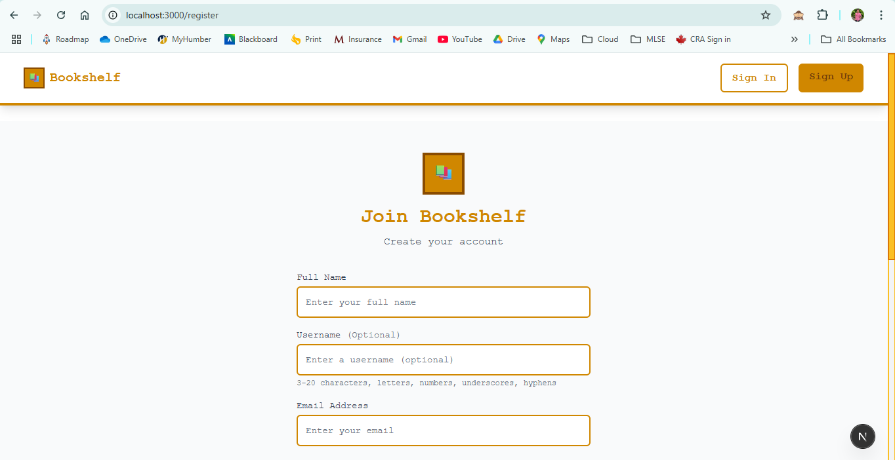
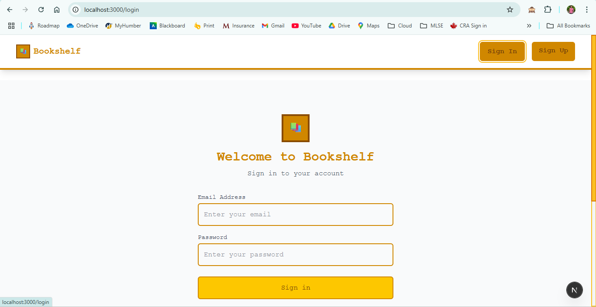
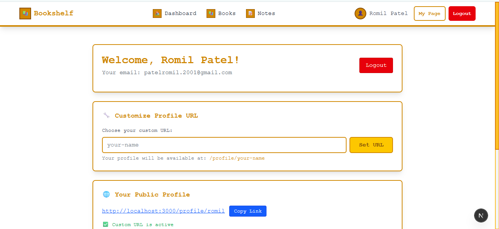
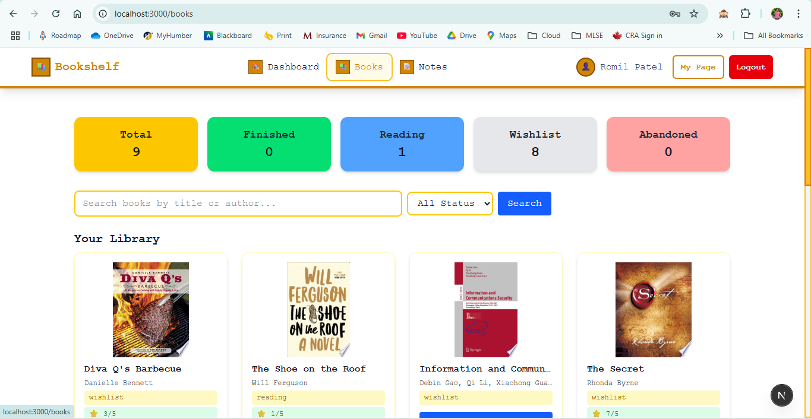
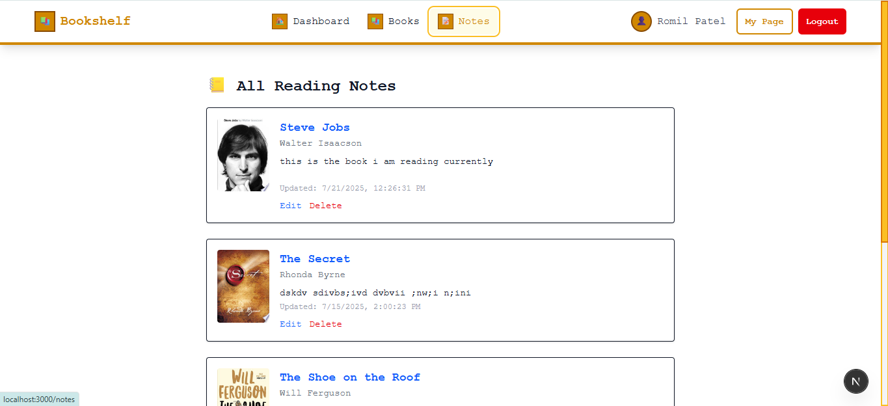
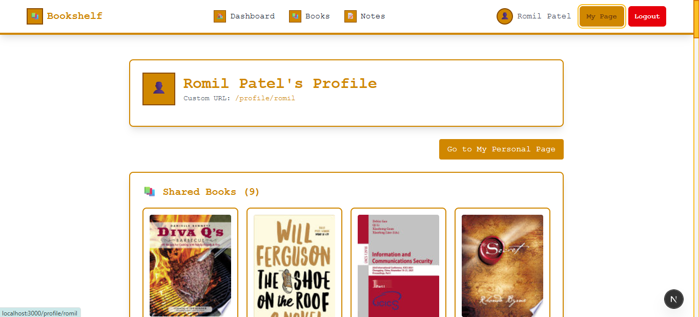
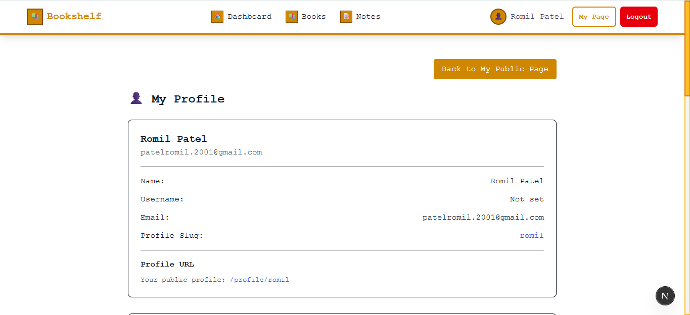

# 📚 Bookshelf - Personal Reading Tracker

# Live Production Link

http://project-phases-sandbank.vercel.app

A modern, full-stack web application for tracking books, taking notes, and analyzing reading habits. Built with Next.js 15, MongoDB, and styled with a unique Minecraft-inspired design.


## ✨ Features

### 🔐 Authentication & Security

- **Custom JWT Authentication** - Secure login/logout with encrypted passwords
- **Password Strength Validation** - Real-time password requirements checking
- **Input Sanitization** - Comprehensive form validation and error handling
- **Protected Routes** - Middleware-based route protection
- **Password Reset** - Email-based password reset functionality
- **Account Recovery** - Secure account recovery options

### 👤 User Profile Management

- **Username System** - Custom usernames with uniqueness validation
- **Profile Customization** - Change username, email, and password
- **Profile URLs** - Custom profile slugs (e.g., `/profile/your-name`)
- **Account Settings** - Centralized account management in My Page
- **Security Verification** - Password confirmation for sensitive changes

### 📖 Book Management

- **Add/Edit/Delete Books** - Complete CRUD operations for your library
- **Reading Status Tracking** - Wishlist, Reading, Finished, Abandoned
- **Rating System** - Rate books from 1-5 stars
- **Tags & Categories** - Organize books with custom tags and categories
- **Reading Dates** - Track start and end dates for books
- **Public/Private Books** - Control which books are visible to others

### 📝 Note Taking

- **Book-Specific Notes** - Take notes for each book individually
- **Rich Text Support** - Multi-line notes with formatting
- **Public/Private Toggle** - Control which notes are shared publicly
- **Note Management** - Edit and delete notes with ease

### 📊 Analytics & Statistics

- **Integrated Dashboard** - All statistics in one place (My Page)
- **Reading Progress Charts** - Visual representation of your reading habits
- **Status Distribution** - See how many books in each reading status
- **Rating Analysis** - Track your rating patterns
- **Monthly Reading Trends** - Monitor your reading over time
- **Tag & Category Analytics** - Understand your reading preferences
- **Interactive Charts** - Hover tooltips and responsive design

### 🌐 Social Features

- **Custom Profile URLs** - Create personalized profile links (e.g., `/profile/your-name`)
- **Public Profiles** - Share your reading journey with others
- **Public Book Sharing** - Choose which books to make public
- **Profile Statistics** - Showcase your reading achievements
- **User Discovery** - Find and follow other readers

### 📱 Responsive Design

- **Mobile-First Approach** - Optimized for all device sizes
- **Touch-Friendly Interface** - Easy navigation on mobile devices
- **Progressive Web App Ready** - Modern web app capabilities
- **Accessibility** - WCAG compliant design patterns

## 🛠️ Technology Stack

### Frontend

- **Next.js 15** - React framework with App Router
- **TypeScript** - Type-safe JavaScript development
- **Tailwind CSS** - Utility-first CSS framework
- **Recharts** - Beautiful, composable charting library
- **React Hook Form** - Form validation and management

### Backend

- **Next.js API Routes** - Serverless API endpoints
- **MongoDB** - NoSQL database with Mongoose ODM
- **JWT** - JSON Web Tokens for authentication
- **bcryptjs** - Password hashing and security
- **Zod** - Schema validation

### Development Tools

- **ESLint** - Code linting and quality
- **PostCSS** - CSS processing
- **Turbopack** - Fast bundler for development
- **TypeScript** - Static type checking

## 🚀 Getting Started

### Prerequisites

- Node.js 18+
- MongoDB database
- npm or yarn package manager

### Installation

1. **Clone the repository**

   ```bash
   git clone https://github.com/2025-Summer-ITE-5425-ONB/project-phases-sandbank
   cd project-phases-sandbank
   ```

2. **Install dependencies**

   ```bash
   npm install
   ```

3. **Environment Setup**
   Create a `.env.local` file in the root directory:

   ```env details

   ```

4. **Run the development server**

   ```bash
   npm run dev
   ```

5. **Open your browser**
   Navigate to [http://localhost:3000](http://localhost:3000)

## 📁 Project Structure

```
bookshelf/
├── src/
│   ├── app/                    # Next.js App Router
│   │   ├── api/               # API routes
│   │   │   ├── auth/          # Authentication endpoints
│   │   │   │   ├── login/     # Login API
│   │   │   │   ├── register/  # Registration API
│   │   │   │   ├── logout/    # Logout API
│   │   │   │   ├── me/        # Current user API
│   │   │   │   ├── change-password/    # Password change
│   │   │   │   ├── change-email/       # Email change
│   │   │   │   ├── change-username/    # Username change
│   │   │   │   └── reset-password/     # Password reset
│   │   │   ├── books/         # Book management
│   │   │   ├── notes/         # Note management
│   │   │   ├── profile/       # Public profiles
│   │   │   └── users/         # User management
│   │   ├── books/             # Book pages
│   │   ├── dashboard/         # User dashboard
│   │   ├── login/             # Authentication pages
│   │   ├── register/          # Registration page
│   │   ├── me/                # My Page (profile + stats)
│   │   ├── notes/             # Notes pages
│   │   └── profile/           # Public profile pages
│   ├── components/            # Reusable components
│   ├── context/AuthContext    # User Context
│   ├── hooks/                 # Custom React hooks
│   ├── lib/                   # Utility functions
│   └── models/                # MongoDB schemas
├── public/                    # Static assets
└── middleware.ts              # Route protection
```

## 🔧 Key Features Implementation

### Enhanced User Management

- **Username System**: Users can set custom usernames during registration or update them later
- **Profile Management**: Centralized account settings in My Page with password verification
- **Security Features**: All sensitive operations require current password confirmation

### Integrated Statistics Dashboard

- **Unified Experience**: Reading statistics are now integrated into My Page
- **Real-time Data**: Charts update automatically as you add/update books
- **Interactive Visualizations**: Hover tooltips and responsive charts
- **Multiple Chart Types**: Bar charts, pie charts, and trend analysis

### Advanced Authentication

- **Password Reset**: Email-based password recovery system
- **Account Security**: Multiple layers of verification for sensitive operations
- **Session Management**: Secure JWT-based authentication with automatic logout

### Real-time Form Validation

- **Client-side Validation**: Instant feedback on form inputs
- **Server-side Validation**: Comprehensive backend validation
- **Error Handling**: User-friendly error messages and recovery options

## 🎨 Design System

The application uses a Minecraft-inspired design with:

- **Color Palette**: Yellow (#fbbf24) as primary, with supporting grays and accent colors
- **Typography**: Clean, readable fonts with proper hierarchy
- **Components**: Blocky, pixelated-style elements with thick borders
- **Animations**: Smooth transitions and hover effects
- **Icons**: Emoji-based icons for a playful, approachable feel
- **Responsive Design**: Optimized for desktop, tablet, and mobile

## Screenshots

Home Screen


Register Page


Login Page


Dashboard Page


Books Page


Notes Page


Profile Page


Profile Set Up Page


## 🔒 Security Features

- **Password Hashing**: bcrypt with 12 salt rounds for maximum security
- **JWT Tokens**: Secure, time-limited authentication tokens
- **Input Validation**: Comprehensive server-side validation for all inputs
- **XSS Protection**: Proper data sanitization and encoding
- **CSRF Protection**: Built-in Next.js protections
- **Rate Limiting**: Protection against brute force attacks
- **Secure Headers**: Security headers for enhanced protection

## 📊 Performance Optimizations

- **Image Optimization**: Next.js automatic image optimization
- **Code Splitting**: Automatic route-based code splitting
- **Caching**: Efficient caching strategies for API responses
- **Database Indexing**: Optimized MongoDB queries with proper indexing
- **Bundle Optimization**: Minimal bundle sizes with tree shaking
- **Lazy Loading**: Components loaded on demand
- **Turbopack**: Fast development bundler

## 🧪 Testing & Quality Assurance

The application includes comprehensive error handling and validation:

- **TypeScript**: Full type safety across the application
- **ESLint**: Code quality and consistency
- **Form Validation**: Both client and server-side validation
- **Error Boundaries**: Graceful error handling
- **Accessibility**: WCAG compliant design patterns

For production deployment, consider adding:

- Unit tests with Jest
- Integration tests with Playwright
- API endpoint testing
- Accessibility testing
- Performance testing

## 🚀 Deployment

### Vercel (Recommended)

1. Connect your GitHub repository to Vercel
2. Set environment variables in Vercel dashboard:
   - `MONGODB_URI`
   - `JWT_SECRET`
3. Deploy automatically on push to main branch

### Other Platforms

The application can be deployed to any platform supporting Next.js:

- **Netlify**: Static site hosting with serverless functions
- **Railway**: Full-stack deployment platform
- **DigitalOcean App Platform**: Managed container deployment
- **AWS Amplify**: AWS-powered hosting solution

## 📈 Recent Updates

### v2.0.0 - Enhanced User Experience

- ✅ **Username System**: Added custom username support
- ✅ **Integrated Statistics**: Merged stats into My Page
- ✅ **Enhanced Security**: Improved password reset and account management
- ✅ **Better UX**: Streamlined navigation and user flows
- ✅ **TypeScript Improvements**: Enhanced type safety throughout
- ✅ **Performance Optimizations**: Faster loading and better caching

### v1.0.0 - Core Features

- ✅ **Book Management**: Complete CRUD operations
- ✅ **Note Taking**: Rich text notes with privacy controls
- ✅ **Authentication**: Secure JWT-based auth system
- ✅ **Social Features**: Public profiles and sharing
- ✅ **Analytics**: Reading statistics and charts

## 🤝 Contributing

1. Fork the repository
2. Create a feature branch (`git checkout -b feature/amazing-feature`)
3. Commit your changes (`git commit -m 'Add amazing feature'`)
4. Push to the branch (`git push origin feature/amazing-feature`)
5. Open a Pull Request

### Development Guidelines

- Follow TypeScript best practices
- Maintain consistent code style with ESLint
- Add proper error handling
- Include form validation
- Test on multiple devices and browsers

## 📝 License

This project is licensed under the MIT License - see the [LICENSE](LICENSE) file for details.

## 🙏 Acknowledgments

- **Next.js Team** - For the amazing React framework
- **Tailwind CSS** - For the utility-first CSS framework
- **MongoDB** - For the flexible database solution
- **Recharts** - For the beautiful charting library
- **React Hook Form** - For efficient form management
- **Zod** - For robust schema validation

Roles And Implementation
Feature Breakdown with Tech Stack per Feature
User Account – Romil
• Features:
o Secure registration and login
o JWT-based authentication with hashed passwords (bcrypt)
o Personal dashboard with reading overview
o Password update and profile settings

Book Management – Tommy
• Features:
o Search/import books using Google Books API
o Organize books into custom lists (Wishlist, Reading, Finished, Abandoned)
o Edit book details: status, dates, rating, tags

Personal Notes – Shrusti
• Features:
o Add reflections or notes for each book
o Save favorite quotes or passages
o Tag notes for filtering/search

Reading Stats – Bhavya
• Features:
o Visual analytics (books read, categories, time trends)
o Progress tracking bar for current reads
o Yearly reading summaries

## 🎯 Project Status

**Current Version**: v2.0.0  
**Status**: Production Ready  
**Last Updated**: December 2024  
**Next.js Version**: 15.3.3  
**TypeScript Version**: 5.x

This is a complete, full-stack Next.js TypeScript application with all essential features for a modern web application.

---

_This project demonstrates modern web development practices and serves as a comprehensive example of a Next.js TypeScript application with MongoDB integration._
